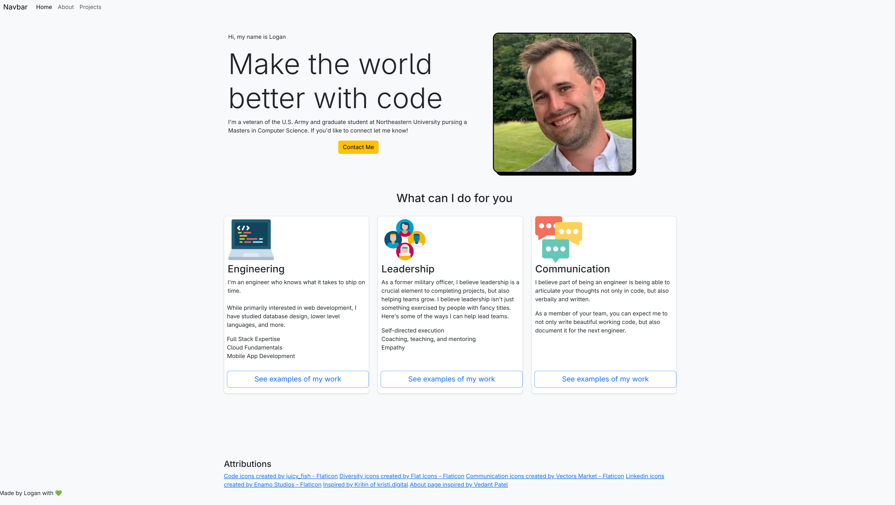
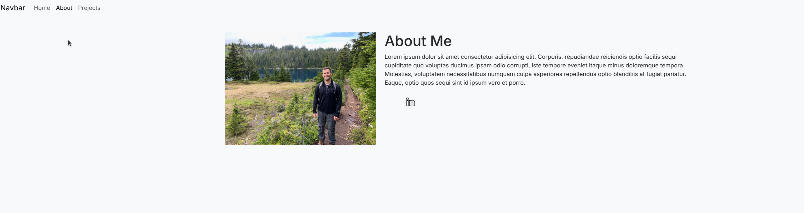
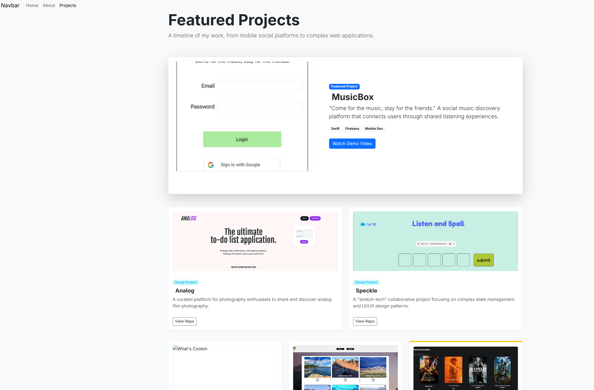

# Welcome to Logan's Portfolio

    

A modern, responsive portfolio website showcasing my skills, projects, and professional journey as a Computer Science graduate student and U.S. Army veteran.

**🔗 [View Live Portfolio](https://loganpaulmatheny.github.io/logan_portfolio/)**

---

## 📋 Table of Contents

- [Objective](#objective)
- [Technical Notes](#technical-notes)
- [Features](#features)
- [Screenshots](#screenshots)
- [Installation](#installation)
- [AI Assistance](#ai-assistance)
- [Authors and Course Information](#authors-and-course-information)
- [Attributions](#attributions)

---

## 🎯 Objective

### Course Objectives

This assignment implements a homepage using vanilla HTML5, CSS3, and ES6+ JavaScript. The project is a front-end only static page without backend functionality or component libraries. All JavaScript code is written in ES6 modules, with no jQuery dependencies.

**Creative Addition Requirement**: Each portfolio must include a unique creative element that differentiates it from other submissions.

### Broader Objectives

Create a professional portfolio page that:

- Appeals to recruiters and potential employers
- Showcases technical skills and completed projects
- Serves as a living document that can be continuously improved
- Demonstrates proficiency in modern web development technologies

---

## 🔧 Technical Notes

### Technologies Used

#### Core Technologies

-  **HTML5** - Semantic markup and structure
-  **CSS3** - Styling and responsive design
-  **ES6+ JavaScript** - Interactive functionality

#### Frameworks & Libraries

-  **Bootstrap 5** - Responsive grid system and components
-  **Font Awesome** - Icons and visual elements

#### Development & Deployment

-  **Git** - Version control
-  **GitHub Pages** - Hosting and deployment

---

## ✨ Features

### 1. Email Copy-to-Clipboard (Creative JavaScript Implementation)

The portfolio features an innovative contact button that copies my email address to the user's clipboard with visual feedback.

**Implementation:**

```javascript
// ===COPY EMAIL TO CLIPBOARD===
async function copyEmail() {
  const email = "matheny.l@northeastern.edu";
  try {
    // navigator.clipboard gives access to the clipboard and we're writing the text to it
    await navigator.clipboard.writeText(email);
    // Then we simply use JS to modify the button's appearance for a second or two
    const btn = document.getElementById("contact-btn");
    const originalText = btn.innerHTML;
    btn.innerHTML = "Email Copied!";
    // Notice we can access the class list here and similarly below we can change back the styling
    btn.classList.replace("btn-warning", "btn-success");
    setTimeout(() => {
      btn.innerHTML = originalText;
      btn.classList.replace("btn-success", "btn-warning");
    }, 2000);
  } catch (err) {
    console.error("Failed to copy!", err);
  }
}
```

**Why This Implementation?**

- Demonstrates practical JavaScript functionality beyond trivial examples
- Uses modern async/await syntax
- Provides immediate user feedback through DOM manipulation
- Implements error handling for robust user experience

### 2. Skills Grid Showcase (Creative Visual Design)

The portfolio features a visually striking grid layout showcasing three core competencies: Engineering, Leadership, and Communication.

**Design Approach:**

- Adapted Bootstrap pricing templates for skill display
- Custom color schemes and iconography
- Responsive card layout that adapts to screen sizes
- Integration of Flaticon assets with proper attribution

---

## 📸 Screenshots

### Homepage Hero Section


_Clean, modern design with compelling call-to-action and professional profile image_

### About


_A minimal page to be used in the future to tell recruiters a little bit more about the things that make me unique_

### Projects


_A page made with the help of AI to showcase projects that I've worked on in the past showcasing a variety of languages and skills_

---

## 💻 Installation

### Prerequisites

- A modern web browser (Chrome, Firefox, Safari, or Edge)
- Git (optional, for cloning)
- A code editor (VS Code, NeoVim, etc.) if you plan to modify the templates for your own use

### Option 1: View Online

Simply visit the live deployment:

```
https://loganpaulmatheny.github.io/logan_portfolio/
```

### Option 2: Clone and Run Locally

1. **Clone the repository:**

   ```bash
   git clone https://github.com/loganpaulmatheny/logan_portfolio.git
   ```

2. **Navigate to the project directory:**

   ```bash
   cd logan_portfolio
   ```

3. **Open in browser:**
   - Simply open `index.html` in your preferred web browser
   - Or use a local server (recommended):

   **Using Python:**

   ```bash
   # Python 3
   python -m http.server 8000
   ```

   Then visit `http://localhost:8000`

   **Using Node.js (http-server):**

   ```bash
   npx http-server
   ```

   **Using VS Code:**
   - Install the "Live Server" extension
   - Right-click `index.html` and select "Open with Live Server"

---

## 🤖 AI Assistance

This project was mostly of my own creation, but AI tools were used strategically to enhance development efficiency of the process as directed by the instructor. Here are some of the ways it was utilized.

### 1. **Sticky Navigation Troubleshooting**

- **Challenge**: Implementing a navigation bar that remains fixed at the top while scrolling
- **AI Contribution**: Helped debug CSS positioning issues and Bootstrap navbar behavior
- **Outcome**: Achieved smooth sticky navigation with proper z-index layering and responsive behavior

### 2. **Projects Showcase Page Generation**

- **Challenge**: Creating a visually appealing and functional projects display page
- **AI Contribution**: Generated initial HTML structure and CSS layouts for project cards
- **Human Refinement**: Customized styling, added personal projects, and optimized responsiveness, updated language, etc...
- **Outcome**: Professional project gallery that can be easily expanded with future work and meets the projects requirement of having one AI generated page

### 3. **README Documentation**

- **Challenge**: Creating comprehensive, professional documentation
- **AI Contribution**: Structured README content, generated technical descriptions, and formatted markdown
- **Human Input**: The initial README was created by myself and then I asked Claude AI to specifically assist with making it more profession and add improved styling to the markdown
- **Outcome**: Clear, detailed documentation that meets academic and professional standards - significantly better than the original README product, while also giving the author experience in how to work with AI to create a better outcome

### AI Usage Philosophy

AI was used as a **development accelerator** and **learning tool**, not as a replacement for understanding core concepts. All code was reviewed, tested, and understood before implementation

- Reduced time spent on boilerplate code
- Explored alternative solutions to technical challenges
- Enhanced learning through exposure to best practices

---

## 👨‍💻 Authors and Course Information

**Logan Matheny**

- 🎓 Graduate Student, M.S. Computer Science - Northeastern University
- 🪖 West Point Graduate and U.S. Army Veteran
- 📧 [matheny.l@northeastern.edu](mailto:matheny.l@northeastern.edu)
- 💼 [LinkedIn Profile](https://www.linkedin.com/in/logan-matheny/)
- 🐙 [GitHub Profile](https://github.com/loganpaulmatheny)

**Course Information**

- **Course**: CS5610 Web Development
- **Semester**: Spring 2026
- **Instructor**: John Guerra
- **Course Website**: [CS5610 Online Spring 2026](https://johnguerra.co/classes/webDevelopment_online_spring_2026/)

---

## 📚 Attributions

### Icons and Images

- [Code icons created by juicy_fish - Flaticon](https://www.flaticon.com/free-icons/code)
- [Diversity icons created by Flat Icons - Flaticon](https://www.flaticon.com/free-icons/diversity)
- [Communication icons created by Vectors Market - Flaticon](https://www.flaticon.com/free-icons/communication)
- [LinkedIn icons created by Enamo Studios - Flaticon](https://www.flaticon.com/free-icons/linkedin)

### Design Inspiration

- [Inspired by Kristi of kristi.digital](https://kristi.digital/)
- [About page inspired by Vedant Patel](https://dribbble.com/shots/6063224-About-me-Portfolio-Website-UI)

---

## 📝 License

This project is created for academic purposes as part of CS5610 at Northeastern University. All rights reserved by Logan Matheny.

---

## 🚀 Future Enhancements

- [ ] Add dark mode toggle
- [ ] Add blog section for technical writing
- [ ] Integrate contact form with backend service
- [ ] Add animation on scroll effects

---

**Made with 💚 by Logan Matheny**

_Last Updated: January 2026_
